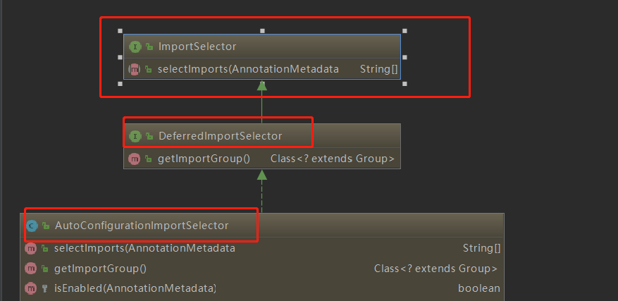
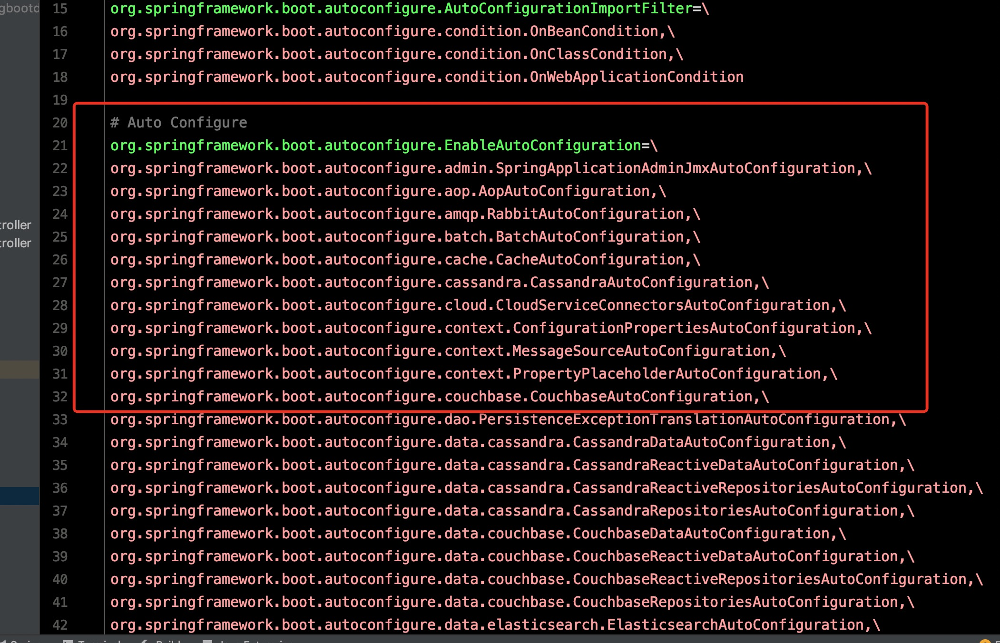

# @SpringBootApplication解析

每一个springboot的启动类都会有@springBootApplication这样一个注解，@SpringBootApplication是一个复合注解，包括：

- @Configuration（@SpringBootConfiguration点开查看发现里面还是应用了@Configuration）
- @EnableAutoConfiguration
- @ComponentScan

然后我们就具体说说这三个注解

## @Configuration

@Configuration 就是以javaConfig形式的Spring Ioc 容器的配置类所使用的那个@Configuration，标注了这个注解之后，就成为一个Ioc 容器的配置类。

下面说下XML和config配置方式的区别：

表示层

*  基于XML配置的方式：

```xml
<?xml version="1.0" encoding="UTF-8"?>
<beans xmlns="http://www.springframework.org/schema/beans"
       xmlns:xsi="http://www.w3.org/2001/XMLSchema-instance"
       xsi:schemaLocation="http://www.springframework.org/schema/beans http://www.springframework.org/schema/beans/spring-beans-3.0.xsd"
       default-lazy-init="true">
    <!--bean定义-->
</beans>
```

* 基于javaConfig 配置配置方式：

```java
@Configuration
public class MockConfiguration{
    //bean定义
}
```


定义bean

* XML

```XML
<bean id="mockService" class="..MockServiceImpl">
    ...
</bean>
```

* javaConfig

```java
@Configuration
public class MockConfiguration{
    @Bean
    public MockService mockService(){
        return new MockServiceImpl();
    }
}
```

bean层面嵌套

* XML

```xml
<bean id="mockService" class="..MockServiceImpl">
    <propery name ="dependencyService" ref="dependencyService" />
</bean>

<bean id="dependencyService" class="DependencyServiceImpl"></bean>
```

* javaConfig

```java
@Configuration
public class MockConfiguration{
    @Bean
    public MockService mockService(){
        return new MockServiceImpl(dependencyService());
    }
    
    @Bean
    public DependencyService dependencyService(){
        return new DependencyServiceImpl();
    }
}
```

如果一个bean的定义依赖其他bean,则直接调用对应的JavaConfig类中依赖bean的创建方法就可以了。

## @ComponentScan

@ComponentScan，它对应XML配置中的元素，@ComponentScan的功能其实就是自动扫描并加载符合条件的组件（比如@Component和@Repository等）或者bean定义，最终将这些bean定义加载到IoC容器中。

我们可以通过basePackages等属性来细粒度的定制@ComponentScan自动扫描的范围，如果不指定，则默认Spring框架实现会从声明@ComponentScan所在类的package进行扫描（即@SpringBootApplication所标注的类就是Springboot的启动类）。

## @EnableAutoConfiguration

SpringBoot 之所以这么方便简洁可用，很大程度要归功于这个注解，它主要是把我们所需要的用的bean 都加载到Ioc容器中去，进行了自动配置，让我们可以方便的使用。定义了一系列@EnableXXX的注解通过@Import收集注册相关的Bean.
@EnableAutoConfiguration也是一个复合注解

```java
@SuppressWarnings("deprecation")
@Target(ElementType.TYPE)
@Retention(RetentionPolicy.RUNTIME)
@Documented
@Inherited
@AutoConfigurationPackage
@Import(EnableAutoConfigurationImportSelector.class)
public @interface EnableAutoConfiguration {
    ...
}
```

主要是@AutoConfigurationPackage @Import(EnableAutoConfigurationImportSelector.class)

* @AutoConfigurationPackage注解：

```java
static class Registrar implements ImportBeanDefinitionRegistrar, DeterminableImports {

        @Override
        public void registerBeanDefinitions(AnnotationMetadata metadata,
                BeanDefinitionRegistry registry) {
            register(registry, new PackageImport(metadata).getPackageName());
        }
```

返回了当前主程序类的同级以及子级的包组件

## Import(AutoConfigurationImportSelector.class)注解：



AutoConfigurationImportSelector 继承了 DeferredImportSelector 继承了 ImportSelector

ImportSelector 有一个方法是selectImports

```java
@Override
    public String[] selectImports(AnnotationMetadata annotationMetadata) {
        if (!isEnabled(annotationMetadata)) {
            return NO_IMPORTS;
        }
        AutoConfigurationMetadata autoConfigurationMetadata = AutoConfigurationMetadataLoader
                .loadMetadata(this.beanClassLoader);
        AnnotationAttributes attributes = getAttributes(annotationMetadata);
        List<String> configurations = getCandidateConfigurations(annotationMetadata,
                attributes);
        configurations = removeDuplicates(configurations);
        Set<String> exclusions = getExclusions(annotationMetadata, attributes);
        checkExcludedClasses(configurations, exclusions);
        configurations.removeAll(exclusions);
        configurations = filter(configurations, autoConfigurationMetadata);
        fireAutoConfigurationImportEvents(configurations, exclusions);
        return StringUtils.toStringArray(configurations);
    }


protected List<String> getCandidateConfigurations(AnnotationMetadata metadata, AnnotationAttributes attributes) {
		List<String> configurations = SpringFactoriesLoader.loadFactoryNames(getSpringFactoriesLoaderFactoryClass(),
				getBeanClassLoader());
		Assert.notEmpty(configurations, "No auto configuration classes found in META-INF/spring.factories. If you "
				+ "are using a custom packaging, make sure that file is correct.");
		return configurations;
	}

```

实际上是通过**getCandidateConfigurations(annotationMetadata,attributes);**去加载**"META-INF/spring.factories"**文件，



**META-INF/spring.factories**文件中有很多自动配置的类，然后通过选择和判断把对应的所有符合条件的@Configuration配置都加载到Ioc容器中来，这就实现了自动配置。

---

这基本上就是@SpringBootApplication注解的工作原理了，对于具体的如何判断当前运行环境需要加载那些配置类进入到Ioc容器中稍后在做一篇笔记做介绍。

---


## SpringFactoriesLoader

借助于Spring框架原有的一个工具类：SpringFactoriesLoader的支持，@EnableAutoConfiguration可以智能的自动配置功效才得以大功告成！SpringBootApplication类初始化的时候也用到这个工具类来记载初始化上下文和Listener

主要就是依赖配置文件中获取的类全限定名通过反射拿到实例后加载到Ioc的容器中去。我在Spring Boot启动中有详细介绍。

