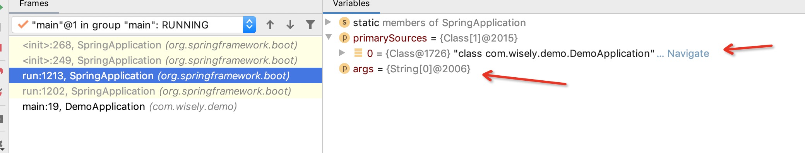
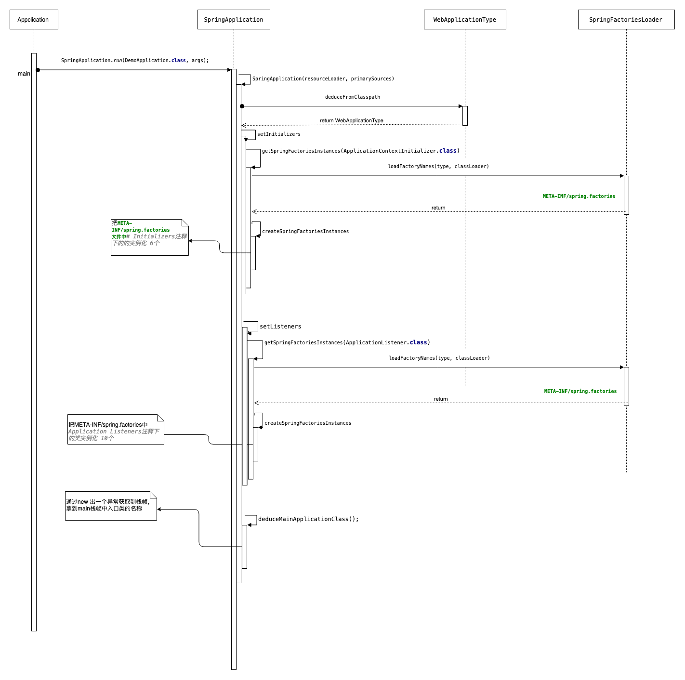
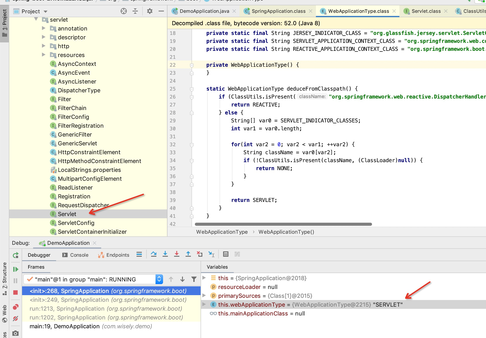
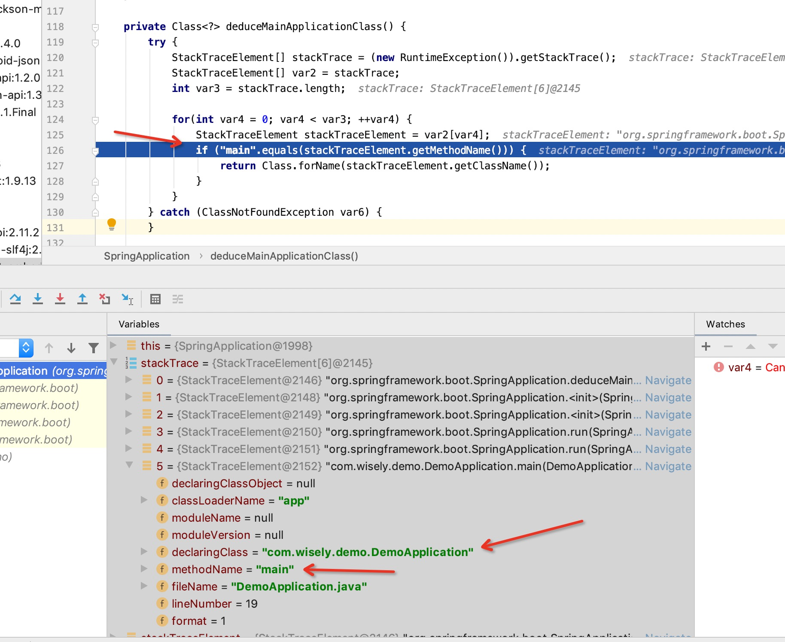

# Spring Boot启动

文档基于Spring Boot 2.16版本进行分析

## Spring Boot 的入口类

```java
@SpringBootApplication
public class DemoApplication {

    public static void main(String[] args) {

        SpringApplication.run(DemoApplication.class, args);
    }

```

上面是 Spring Boot 最简单通用的入口类。入口类的要求是最顶层包下面第一个含有 main 方法的类，使用注解 `@SpringBootApplication`来启用 Spring Boot 特性，使用 `SpringApplication.run` 方法来启动 Spring Boot 项目。

@SpringBootApplication 实际上是三个注解的组合注解，分别是@SpringBootConfiguration，@ComponentScan，@EnableAutoConfiguration，关于这个注解稍后详细介绍。

先来看一下这个类的 `run` 方法调用关系源码：

```java
public static ConfigurableApplicationContext run(Class<?> primarySource,
        String... args) {
    return run(new Class<?>[] { primarySource }, args);
}

public static ConfigurableApplicationContext run(Class<?>[] primarySources,
        String[] args) {
    return new SpringApplication(primarySources).run(args);
}
```

第一个参数 `primarySource`：加载的主要资源类

第二个参数 `args`：传递给应用的应用参数，也就是main中的args



然后进入SpringApplication的构造方法

```java
public SpringApplication(Class<?>... primarySources) {
        this((ResourceLoader)null, primarySources);
    }

    public SpringApplication(ResourceLoader resourceLoader, Class<?>... primarySources) {
       
        this.sources = new LinkedHashSet();
        this.bannerMode = Mode.CONSOLE;
        this.logStartupInfo = true;
        this.addCommandLineProperties = true;
        this.addConversionService = true;
        this.headless = true;
        this.registerShutdownHook = true;
        this.additionalProfiles = new HashSet();
        this.isCustomEnvironment = false;
      // 资源初始化资源加载器为 null
        this.resourceLoader = resourceLoader;
      // 断言主要加载资源类不能为 null，否则报错
        Assert.notNull(primarySources, "PrimarySources must not be null");
      //初始化主要加载资源类集合并去重
        this.primarySources = new LinkedHashSet(Arrays.asList(primarySources));
      //推断当前 WEB 应用类型
        this.webApplicationType = WebApplicationType.deduceFromClasspath();
//设置应用上线文初始化器	       		
    this.setInitializers(this.getSpringFactoriesInstances(ApplicationContextInitializer.class));
      //设置监听器 
        this.setListeners(this.getSpringFactoriesInstances(ApplicationListener.class));
      //推断主入口应用类
        this.mainApplicationClass = this.deduceMainApplicationClass();
    }
```

## 时序图



主要过程有下面个过程

1. #### 资源初始化资源加载器为 null

```java
this.resourceLoader = resourceLoader;
```

2. 断言主要加载资源类不能为 null，否则报错

```java
 Assert.notNull(primarySources, "PrimarySources must not be null");
```

3. 初始化主要加载资源类集合并去重
```java
this.primarySources = new LinkedHashSet(Arrays.asList(primarySources));
```

4. 推断当前 WEB 应用类型
```java
this.webApplicationType = WebApplicationType.deduceFromClasspath();
```

看一下deduceFromClasspath方法相关的源码

```java
    private static final String[] SERVLET_INDICATOR_CLASSES = new String[]{"javax.servlet.Servlet", "org.springframework.web.context.ConfigurableWebApplicationContext"};
    private static final String WEBMVC_INDICATOR_CLASS = "org.springframework.web.servlet.DispatcherServlet";
    private static final String WEBFLUX_INDICATOR_CLASS = "org.springframework.web.reactive.DispatcherHandler";
    private static final String JERSEY_INDICATOR_CLASS = "org.glassfish.jersey.servlet.ServletContainer";
    private static final String SERVLET_APPLICATION_CONTEXT_CLASS = "org.springframework.web.context.WebApplicationContext";
    private static final String REACTIVE_APPLICATION_CONTEXT_CLASS = "org.springframework.boot.web.reactive.context.ReactiveWebApplicationContext";


public enum WebApplicationType {

    /**
     * 非 WEB 项目
     */
    NONE,

    /**
     * SERVLET WEB 项目
     */
    SERVLET,

    /**
     * 响应式 WEB 项目
     */
    REACTIVE

}


static WebApplicationType deduceFromClasspath() {
if(ClassUtils.isPresent("org.springframework.web.reactive.DispatcherHandler",(ClassLoader)null) && !ClassUtils.isPresent("org.springframework.web.servlet.DispatcherServlet", (ClassLoader)null) && !ClassUtils.isPresent("org.glassfish.jersey.servlet.ServletContainer", (ClassLoader)null)) {
            return REACTIVE;
        } 
  else {
            String[] var0 = SERVLET_INDICATOR_CLASSES;
            int var1 = var0.length;

            for(int var2 = 0; var2 < var1; ++var2) {
                String className = var0[var2];
                if (!ClassUtils.isPresent(className, (ClassLoader)null)){
                    return NONE;
                }
            }

            return SERVLET;
        }
    }
```

因为我这个项目导入了web 所有能找到的javax.servlet.Servlet，所有结果返回就是SERVLET




 5. 设置应用上线文初始化器	       		
```java
this.setInitializers(this.getSpringFactoriesInstances(ApplicationContextInitializer.class));
```
设置应用上下文初始化器可分为以下 5 个步骤。

		1.  获取当前线程上下文类加载器

``` java
ClassLoader classLoader = Thread.currentThread().getContextClassLoader();
```


	2. 获取 ApplicationContextInitializer 的实例名称集合并去重

```java
Set<String> names = new LinkedHashSet<>(
                SpringFactoriesLoader.loadFactoryNames(type, classLoader));
```

loadFactoryNames方法的源码如下

```java
 public static List<String> loadFactoryNames(Class<?> factoryClass, @Nullable ClassLoader classLoader) {
        String factoryClassName = factoryClass.getName();
        return (List)loadSpringFactories(classLoader).getOrDefault(factoryClassName, Collections.emptyList());
    }

    private static Map<String, List<String>> loadSpringFactories(@Nullable ClassLoader classLoader) {
        MultiValueMap<String, String> result = (MultiValueMap)cache.get(classLoader);
        if (result != null) {
            return result;
        } else {
            try {
                Enumeration<URL> urls = classLoader != null ? classLoader.getResources("META-INF/spring.factories") : ClassLoader.getSystemResources("META-INF/spring.factories");
                LinkedMultiValueMap result = new LinkedMultiValueMap();

                while(urls.hasMoreElements()) {
                    URL url = (URL)urls.nextElement();
                    UrlResource resource = new UrlResource(url);
                    Properties properties = PropertiesLoaderUtils.loadProperties(resource);
                    Iterator var6 = properties.entrySet().iterator();

                    while(var6.hasNext()) {
                        Entry<?, ?> entry = (Entry)var6.next();
                        String factoryClassName = ((String)entry.getKey()).trim();
                        String[] var9 = StringUtils.commaDelimitedListToStringArray((String)entry.getValue());
                        int var10 = var9.length;

                        for(int var11 = 0; var11 < var10; ++var11) {
                            String factoryName = var9[var11];
                            result.add(factoryClassName, factoryName.trim());
                        }
                    }
                }

                cache.put(classLoader, result);
                return result;
            } catch (IOException var13) {
                throw new IllegalArgumentException("Unable to load factories from location [META-INF/spring.factories]", var13);
            }
        }
    }
```

根据类路径下的 `META-INF/spring.factories` 文件解析并获取 `ApplicationContextInitializer` 接口的所有配置的类路径名称。

`spring-boot-autoconfigure-2.1.6.RELEASE.jar!/META-INF/spring.factories` 的初始化器相关配置内容如下：

```properties
# Initializers
org.springframework.context.ApplicationContextInitializer=\
org.springframework.boot.autoconfigure.SharedMetadataReaderFactoryContextInitializer,\
org.springframework.boot.autoconfigure.logging.ConditionEvaluationReportLoggingListener
```
	3. 根据返回的路径名称通过反射实例化

```java
 private <T> List<T> createSpringFactoriesInstances(Class<T> type, Class<?>[] parameterTypes, ClassLoader classLoader, Object[] args, Set<String> names) {
        List<T> instances = new ArrayList(names.size());
        Iterator var7 = names.iterator();

        while(var7.hasNext()) {
            String name = (String)var7.next();

            try {
                Class<?> instanceClass = ClassUtils.forName(name, classLoader);
                Assert.isAssignable(type, instanceClass);
                Constructor<?> constructor = instanceClass.getDeclaredConstructor(parameterTypes);
                T instance = BeanUtils.instantiateClass(constructor, args);
                instances.add(instance);
            } catch (Throwable var12) {
                throw new IllegalArgumentException("Cannot instantiate " + type + " : " + name, var12);
            }
        }

        return instances;
    }
```

	4. 对实例化列表进行排序

```java
AnnotationAwareOrderComparator.sort(instances);
```

	5. 返回列表

```java
return instances;
```


6. 设置监听器 

基本执行流程与第五步类似，不过获取的是ApplicationListener.class

```java
this.setListeners(this.getSpringFactoriesInstances(ApplicationListener.class));
```

ApplicationListener 的作用是什么？源码如下。

```java
@FunctionalInterface
public interface ApplicationListener<E extends ApplicationEvent> extends EventListener {

    /**
     * Handle an application event.
     * @param event the event to respond to
     */
    void onApplicationEvent(E event);

}
```

看源码，这个接口继承了 JDK 的 `java.util.EventListener` 接口，实现了观察者模式，它一般用来定义感兴趣的事件类型，事件类型限定于 ApplicationEvent 的子类，这同样继承了 JDK 的 `java.util.EventObject` 接口。

设置监听器和设置初始化器调用的方法是一样的，只是传入的类型不一样，设置监听器的接口类型为：`getSpringFactoriesInstances`，对应的 `spring-boot-autoconfigure-2.0.3.RELEASE.jar!/META-INF/spring.factories` 文件配置内容请见下方。

```properties
# Application Listeners
org.springframework.context.ApplicationListener=\
org.springframework.boot.autoconfigure.BackgroundPreinitializer
```

可以看出目前只有一个 `BackgroundPreinitializer` 监听器。

7. 推断主入口应用类
```java
this.mainApplicationClass = this.deduceMainApplicationClass();
```

这个推断入口应用类的方式有点特别，通过构造一个运行时异常，再遍历异常栈中的方法名，获取方法名为 main 的栈帧，从来得到入口类的名字再返回该类。



