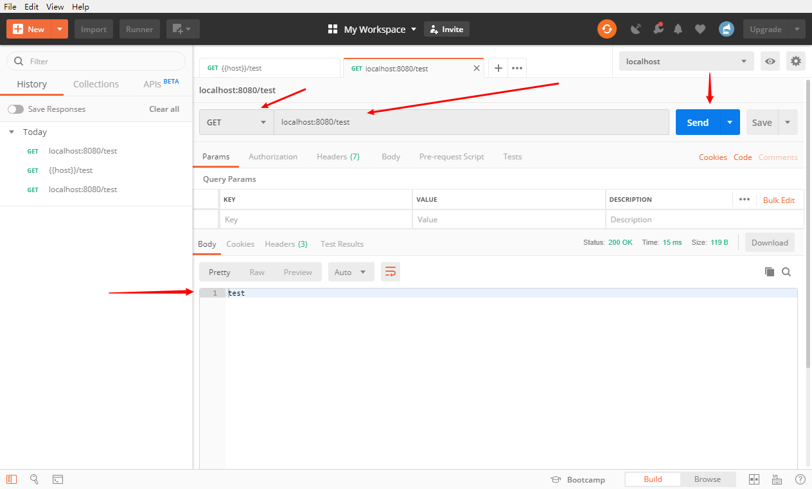
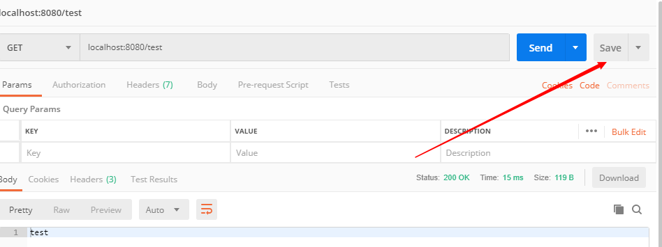
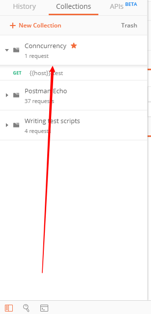
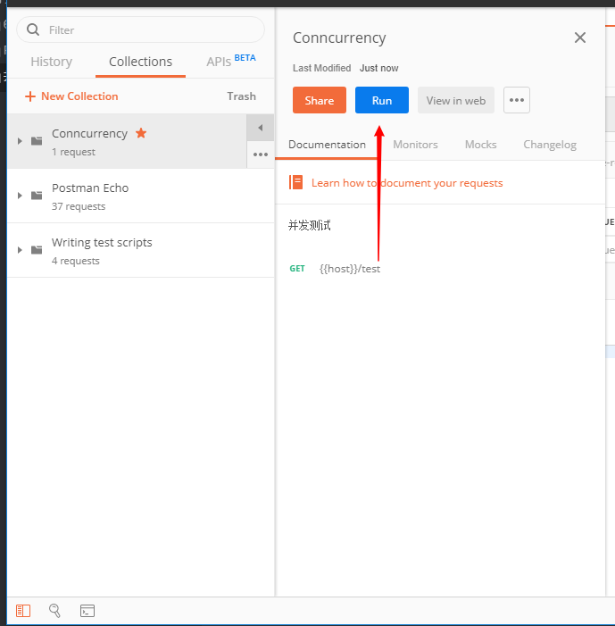
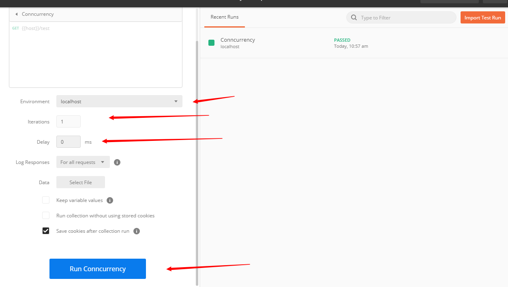
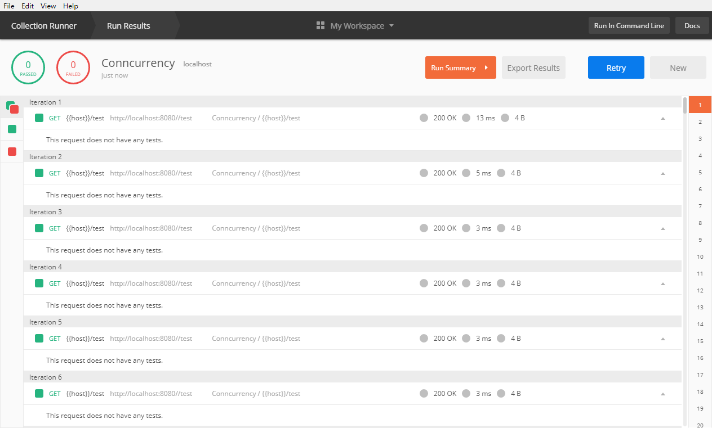
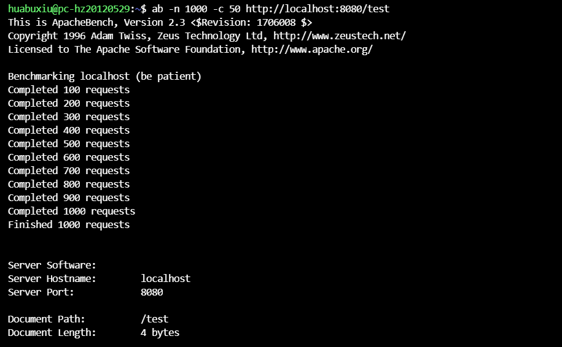
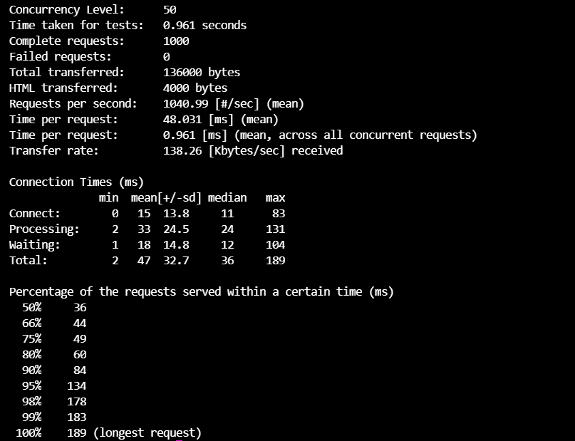
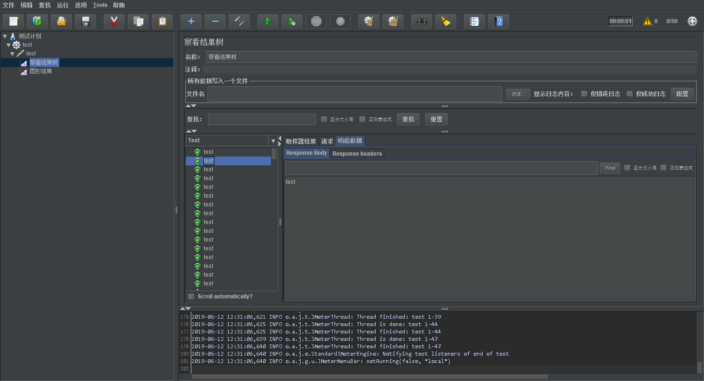

# 并发测试工具

## 一、Postman

Postman一款非常流行的API调试工具。其实，开发人员用的更多。因为测试人员做接口测试会有更多选择，例如Jmeter、soapUI等。不过，对于开发过程中去调试接口，Postman确实足够的简单方便，而且功能强大。

官方网站：<https://www.getpostman.com/>

Postman常用于接口的测试，比如GET，POST等接口的测试


### 使用说明



这就是一个基本的GET接口的测试，接下来介绍一下模仿并发请求

1. 点击Collections


2. 新建一个collection，然后把要测试的接口加入这个collection，并选中

   

   

3. 点击Run



4. 选择运行环境，次数和每次的延迟，然后Run 这个集合

### 结果解析

   可以看到测试结果



## 二、Apache Bench简介

ApacheBench 是 Apache 服务器自带的一个web压力测试工具，简称ab。ab又是一个命令行工具，对发起负载的本机要求很低，根据ab命令可以创建很多的并发访问线程，模拟多个访问者同时对某一URL地址进行访问，因此可以用来测试目标服务器的负载压力。总的来说ab工具小巧简单，上手学习较快，可以提供需要的基本性能指标，但是没有图形化结果，不能监控。


### 使用说明

 用法很简单，使用ab命令就可以

```
参数说明：
格式：ab [options] [http://]hostname[:port]/path

-n requests Number of requests to perform     //本次测试发起的总请求数
-c concurrency Number of multiple requests to make　　 //一次产生的请求数（或并发数）
-t timelimit Seconds to max. wait for responses　　　　//测试所进行的最大秒数，默认没有时间限制。
-r Don't exit on socket receive errors.     // 抛出异常继续执行测试任务 
-p postfile File containing data to POST　　//包含了需要POST的数据的文件，文件格式如“p1=1&p2=2”.使用方法是 -p 111.txt

-T content-type Content-type header for POSTing
//POST数据所使用的Content-type头信息，如 -T “application/x-www-form-urlencoded” 。 （配合-p）
-v verbosity How much troubleshooting info to print
//设置显示信息的详细程度 – 4或更大值会显示头信息， 3或更大值可以显示响应代码(404, 200等), 2或更大值可以显示警告和其他信息。 -V 显示版本号并退出。
-C attribute Add cookie, eg. -C “c1=1234,c2=2,c3=3” (repeatable)
//-C cookie-name=value 对请求附加一个Cookie:行。 其典型形式是name=value的一个参数对。此参数可以重复，用逗号分割。
提示：可以借助session实现原理传递 JSESSIONID参数， 实现保持会话的功能，如-C ” c1=1234,c2=2,c3=3, JSESSIONID=FF056CD16DA9D71CB131C1D56F0319F8″ 。
-w Print out results in HTML tables　　//以HTML表的格式输出结果。默认时，它是白色背景的两列宽度的一张表。
-i Use HEAD instead of GET
-x attributes String to insert as table attributes
-y attributes String to insert as tr attributes
-z attributes String to insert as td or th attributes
-H attribute Add Arbitrary header line, eg. ‘Accept-Encoding: gzip’ Inserted after all normal header lines. (repeatable)
-A attribute Add Basic WWW Authentication, the attributes
are a colon separated username and password.
-P attribute Add Basic Proxy Authentication, the attributes are a colon separated username and password.
-X proxy:port Proxyserver and port number to use
-V Print version number and exit
-k Use HTTP KeepAlive feature
-d Do not show percentiles served table.
-S Do not show confidence estimators and warnings.
-g filename Output collected data to gnuplot format file.
-e filename Output CSV file with percentages served
-h Display usage information (this message)
```

平时使用 -n 说明请求次数，-c 说明并发量就可以了





### 结果解析

```

Document Path:          /index.html
Document Length:        17784 bytes     #请求文档大小
 
Concurrency Level:      10              #并发数
Time taken for tests:   11.898681 seconds    #全部请求完成耗时
Complete requests:      100            #全部请求数     
Failed requests:        0
Write errors:           0
Total transferred:      1805900 bytes      #总传输大小
HTML transferred:       1778400 bytes
Requests per second:    8.40 [#/sec] (mean)    #每秒请求数（平均）
Time per request:       1189.868 [ms] (mean)  #每次并发请求时间（所有并发）
Time per request:       118.987 [ms] (mean, across all concurrentrequests
Transfer rate:          148.17 [Kbytes/sec] received    #传输速率
 
Connection Times (ms)           #连接时间
                      min mean[+/-sd]  median(中位值)  max
Connect: （#连接）     59   73  11.9     72     132
Processing: （#处理）    86   998538.7     938   2288
Waiting: （#等待）     63   135 106.8     94    663
Total:                 155  1072540.6    1004   2362
 
在一定比例的请求服务时间
 
 50%   1004
 66%   1260
 75%   1452
 80%   1492
 90%   1923
 95%   2078
 98%   2352
 99%   2362
 100%  2362 (longest request)
```


## 三、JMeter

Apache JMeter是Apache组织开发的基于Java的压力测试工具。用于对软件做压力测试，它最初被设计用于Web应用测
试但后来扩展到其他测试领域。 它可以用于测试静态和动态资源例如静态文件、Java 小服务程序、CGI 脚本、Java 对象、数据库， FTP 服务器， 等等。JMeter 可以用于对服务器、网络或对象模拟巨大的负载，来在不同压力类别下测试它们的强度和分析整体性能。另外，JMeter能够对应用程序做功能/回归测试，通过创建带有断言的脚本来验证你的程序返回了你期望的结果。

## 使用说明

由于JMeter功能非常强大，所以此处引用[老_张](https://home.cnblogs.com/u/imyalost/)的博客进行说明

[《jmeter：菜鸟入门到进阶系列》](https://www.cnblogs.com/imyalost/p/7062784.html)

**1、基础介绍**
简单介绍jmeter的元件组成，作用等基础知识； 

**2、录制脚本**
简述了jmeter录制脚本的2种方式；

**3、元件的作用域及执行顺序**
jmeter各元件的作用域及执行的顺序；

**4、Sampler之SOAP/XML-RPC Request**
取样器中关于SOAP/XML-RPC Request的用法；

**5、Sampler之HTTP请求**
取样器中关于HTTP请求的用法；

**6、http请求之content-type**
取样器中关于HTTP请求的补充说明；

**7、Sample之JDBC Request**
取样器中关于JDBC请求的用法；

**8、JDBC Request之Query Type**
取样器中关于JDBC请求的补充说明； 

**9、目录结构**
jmeter目录结构等简单介绍；

**10、参数化**
jmeter参数化的4种方式；

**11、关联之正则表达式提取器**
jmeter关联之正则表达式提取器的用法；

**12、关联之XPath Extractor**
jmeter关联之XPath Extractor的用法； 

**13、配置元件之计数器**
jmeter配置元件中关于计数器的用法；

**14、配置元件之HTTP属性管理器**
jmeter配置元件中关于http属性管理器的用法；

**15、函数助手**
jmeter内置函数助手的简单介绍；

**16、定时器**
jmeter八大元件之定时器的介绍；

**17、断言**
jemter八大元件之断言的介绍； 

**18、逻辑控制器**
jmeter八大元件之逻辑控制器的介绍； 

**19、常见问题及解决方法**
jmeter使用过程中常见问题及解决方案的说明；

**20、阶梯式加压测试**
jmeter扩展插件Stepping Thread Group的简单介绍；

**21、jmeter常用插件介绍**
jmeter插件Transactions per Second、Response Times Over Time、PerfMon Metrics Collector的下载安装及使用；

**22、内存溢出原因及解决方法**
关于jmeter做压力负载测试时候遇到内存溢出的原因和解决方法；

**23、jmeter分布式测试**
关于高并发情况下分布式测试的一些技术点和注意事项；

**24、dubbo接口测试**
利用jmeter的dubbo插件进行dubbo接口测试和性能测试；

**25、linux环境运行jmeter并生成报告**
linux环境，非GUI模式运行jmeter脚本进行性能测试，并生成测试报告的介绍；

**26、jmeter生成HTML格式性能测试报告**
jmeter生成HTML格式的性能测试报告的2种方式，以及可视化图表解析内容；

### 结果解析

