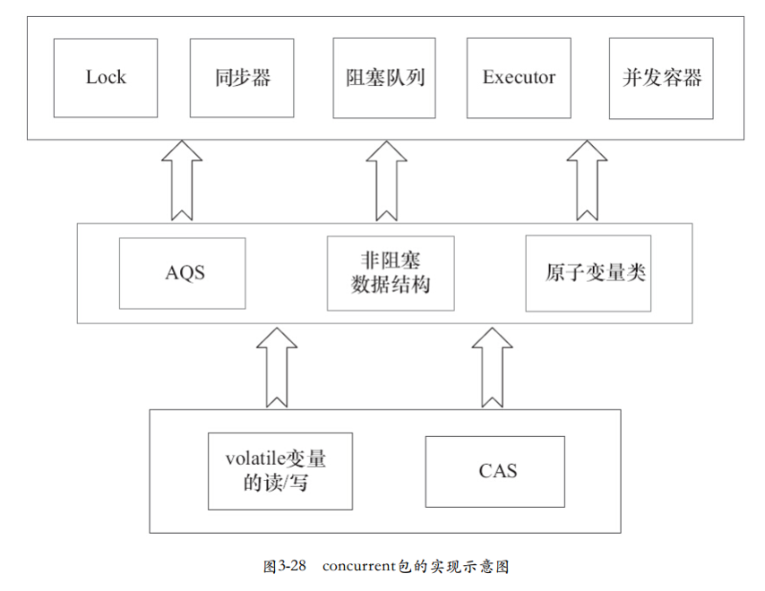

# Java 内存模型

## 基础知识

### 线程同步

同步是指程序中用于控制不同线程间操作发生相对顺序的机制，共享内存模型中，同步必须显式的控制，代码中某个部分需要在线程之间互斥操作。

### 线程通信

线程之间交换信息称之为线程通信。线程通信的机制有两种：

* 共享内存：通过读写内存的公共状态进行
* 消息传递：线程之间没有公共状态，必须发送消息来进行显式的通信

### 内存模型

JMM规定了线程和主存储之间的关系，由线程和自己的本地内存通信，然后通过读取和刷新主内存，来进行线程之间的通信。

### happens-before

规则：

* 程序顺序规则：一个线程中的每个操作，happens-before于该线程中的任意后续操作
* 监视器锁规则：对一个锁的解锁，happens-before于随后对锁的加锁
* volatile变量规则：对于一个volatile变量的写，happens-before于任意后续对这个变量的读
* 传递性：如果A happens-before B，B happens-before C ,那么A happens-before C
* start() 规则：如果线程A 执行操作ThreadB.start() （启动线程B），那么线程A 的TreadB.start() happens-before 于 线程B的任何操作
* start() 规则：如果线程A 执行操作ThreadB.join() 并成功返回 ，那么线程B 的任意操作 happens-before 于 线程A从ThradB.join() 操作成功返回。

## 重排序

重排序是编译器和处理器为了优化程序性能而对指令进行重新排序的一种手段，JMM实现的具体方针为：在不改变（正确同步的）程序执行结果的前提下，最大限度的允许编译器和处理器进行优化重排。

对于影响程序正确执行结果的部分，使用屏障来禁止重排这一部分的指令。

## volatile

由于volatile变量的读和写都是原子的，或者可以看成是使用同一个锁对单个的volatile变量的单个读/写进行了同步

特性：

* 可见性：对于一个volatile的读，总能看到（任意一个线程）对这个volatile变量的最后的写入。
* 原子性：对任意单个volatile变量的读/写（指令层面）具有原子性，但是类似volatile++这种符合操作不具有原子性

## 锁

### 锁的内存语义

获取锁：实际上是对于同步区域的共享变量从内存中重新读取，对于本地内存置为无效。

释放锁：是把自己的本地变量刷入主内存中同步区域的共享变量。

### 锁内存语义的实现

1. 利用volatile变量的写-读所具有的内存语义。
2. 利用CAS所附带的volatile读和volatile写的内存语义。

### concurrent包的实现

ReentranLock实现依赖框架  AbstractQueuedSynchronizer 简称AQS，在java.util.concurrent.atomic包中

1. 首先声明共享变量为volatile
2. 然后，使用CAS的原子条件更新来实现线程之间的同步
3. 同时，配合volatile变量的写-读和CAS所附带的volatile读和volatile写的内存语义来实现线程之间的通信（主内存）

## 内存模型总结

JMM是语言级别的内存模型，在可见性和效率上取了合适的折中：不改变（正确同步的）程序执行结果的前提下，最大限度的允许编译器和处理器进行优化重排。