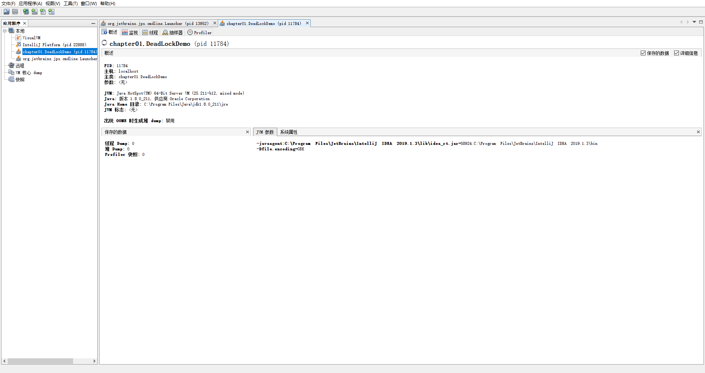
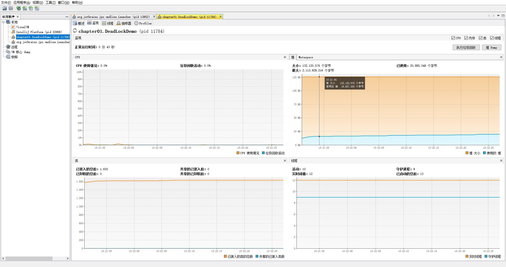
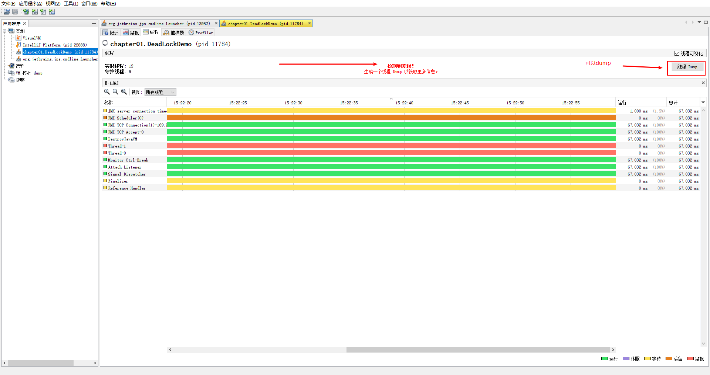

# **用jvisualvm分析dump文件**

最近有一个java服务的堆内存溢出，然后僵死了，在重启服务之前用jmap命令生成了一份dump文件便于后面分析。

**生成dump文件的命令：**

jmap -dump:format=b,file=20170307.dump 16048

file后面的是自定义的文件名，最后的数字是进程的pid。

**使用jvisualvm来分析dump文件：**

jvisualvm是JDK自带的Java性能分析工具，在JDK的bin目录下，文件名就叫jvisualvm.exe。

jvisualvm可以监控本地、远程的java进程，实时查看进程的cpu、堆、线程等参数，对java进程生成dump文件，并对dump文件进行分析。

像我这种从服务器上dump下来文件也可以直接扔给jvisualvm来分析。

如下图：

能够检测到死锁和性能监控

检测线程

通过分析Dump文件就可以发现程序哪里有死锁

