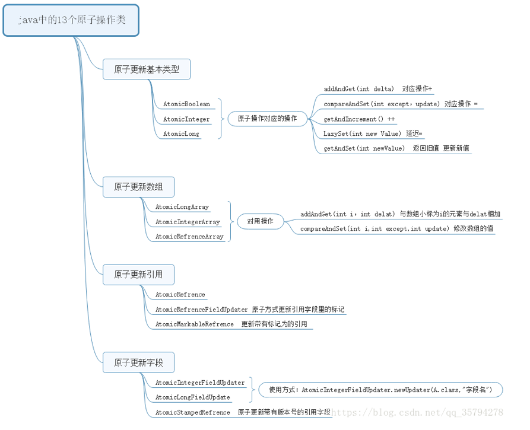

# 原子操作



Java中的原子基本类型有

* AtomicBoolean

* AtomicInteger

* AtomicLong 

常用操作有AtomicInteger的常用方法有：

1. int addAndGet(int delta)：以原子的方式将输入的值与实例中的值（AtomicInteger里的value）相加，并把结果返回
2. boolean compareAndSet(int expect, int update)：如果输入值等于预期值，以原子的方式将该值设置为输入的值
3. final int getAndIncrement()：以原子的方式将当前值加1，并返回加1之前的值
4. void lazySet(int newValue)：最终会设置成newValue，使用lazySet设置值后，可能导致其他线程在之后的一小段时间内还是可以读到旧的值。
5. int getAndSet(int newValue)：以原子的方式将当前值设置为newValue,并返回设置之前的旧值


#### getAndIncrement() 的实现

1. 首先获取volatile 类型的value的值
2. 在线程内部把值加一存储到next 变量中
3. 使用CAS去更新value，
4. 如果CAS失败就自旋尝试

```java
 public final  int getAndIncrement(){
        for (;;){
            int current = get();
            int next = current +1;
            if (compareAndSet(current,next))
                return current;
        }
    }
```


