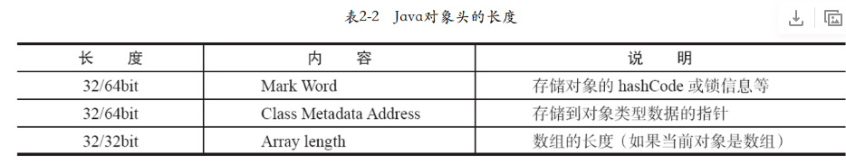
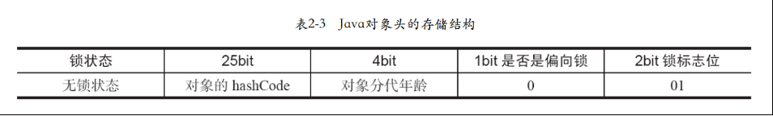
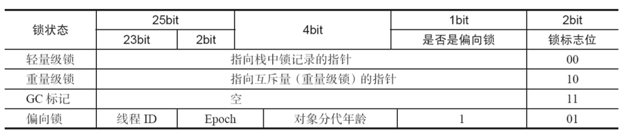
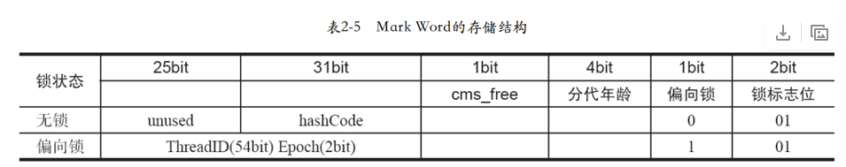

# 并发实现原理


##  volatile

java内存模型中，volatile声明的变量让所有线程都是可见的而且看到时唯一的。

### 实现原理

修改volatile 变量时，所产生的汇编代码会加上 Lock前缀，Lock前缀有两个作用

1. 把当前处理器缓存行写会内存中
2. 对于其他CPU缓存了该地址的数据失效

当处理器把volatile变量写回内存，因为缓存一致协议，其他CPU在嗅探总线上传播的数据来检查自己的缓存是否过期，感受到自己所缓存的volatile变量发生改变后就把对应的缓存行改为不可用，等需要进行操作时，重新读取 。

## synchronized

锁的粒度：

* 普通同步方法：锁是当前实例对象
* 静态同步方法：锁是当前类的Class对象
* 同步方法块：锁是synchronized括号里面的对象

synchronzied 所用的锁是存在java 对象头中间的，如果是数组类型，虚拟机用3个字宽（Word）存储对象头，非数组类型，则用2字宽存储对象头。（1字=4字节 = 4*8（32）bit）

对象头如下所示



Mark Word 信息详情

* 无锁时



* 有锁状态

  

* 64位结构



synchronize 的优化

Java SE 1.6 引入了偏向锁和轻量级锁，膨胀顺序分别是 无锁状态、偏向锁、轻量级锁、重量级锁。

线程占用轻量级锁时会把自己的线程ID写入对象头的Mark Word中去。

## atomic

原子操作，不可中断的一个操作。

* 处理器实现

  1. 通过总线锁来保证操作的原子性

  就是使用处理器提供的一个LOCK#信号，当一个处理器在总线上输出信号时阻塞其他信号，就实现独占内存，实现原子操作

  2. 通过缓存锁来保证原子性

  通过“缓存锁定”来来实现复杂的原子操作，当内存区域在处理器的缓存行中，而且Lock操作期间被锁定，当执行锁操作回写到内存时，处理器修改内部的内存地址，并允许他的缓存一致性机制来保证操作的原子性，因为缓存一致性机制会组织同时修改由两个以上的处理器缓存的内存区域数据，其他处理器中会使缓存行无效。

* java实现

java 可以通过锁和CAS来实现原子操作

1. CAS算法，通过自旋直到成功为止

```java
 /**
     * 使用CAS实现线程安全计数器
     */
    private void safeCount() {

        for (;;) {

            int i = atomicI.get();
            //比较
            boolean suc = atomicI.compareAndSet(i, ++i);
            if (suc) {
                break;
            }
        }
    }
```


CAS 的问题：ABA问题，自旋时间过长，只能保证一个共享变量的原子操作。

ABA的问题解决方案就是对每次的修改加上一个版本号把A->B->A 变成 1A->2B->3A,就可以解决问题，从Java 1.5 之后JDK的Atomic 包中就提供了compareAndSet方法解决了ABA问题。

只能操作单一变量的问题 ：可以把多个变量和并成一个变量进行操作，从Java 1.5 之后JDK的Atomic 包中就提供了AtomicReference类来保证引用对象之间的原子性，所以就可以把多个变量放到一个对象中进行CAS操作


2. 通过锁机制来实现原子操作

锁机制实现了只有获得锁的线程才能操作只能内部区域，就实现了原子操作。