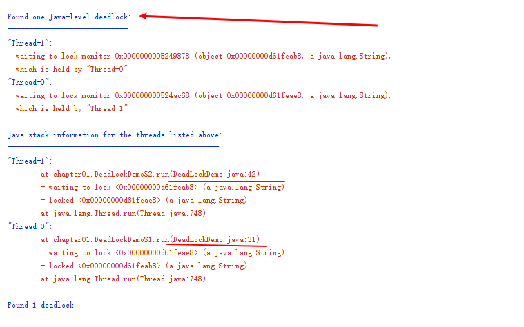

# 影响并发性能的原因


## 上下文切换

CPU 通过时间片分配来并发执行任务，当前任务执行一个时间片后就会切换到下一个任务 ，切换之前会保存当前任务的状态。从保存这个任务的状态到再加载的一次过程就是一次上下文的切换。

过多的上下文切换会带来一些不必要的性能消耗，减少上下文切换的方法有以下几个：

* 无锁并发编程
* CAS算法
* 使用最少线程和使用协程

### 无锁并发编程

多线程竞争锁时就是引起上下文切换，所有通过避免加锁的方式可以减少上下文切换，例如对数据进行Hash取模分段处理，固定的线程去处理固定的数据段。

### CAS算法

通过比较，再去切换，实现了无锁的算法不过会出现ABA问题和自旋时间过长

### 使用最少线程

字面意思，别让大量线程处于等待状态

### 协程

单线程里实现多任务调度

## 死锁

两个或者多个线程互相占用对方想要获取的锁，形成一个占用环，导致系统不可以用。


``` java
 private void deadLock() {
        Thread t1 = new Thread(new Runnable() {
            @Override
            public void run() {
                synchronized (A) {
                    try {
                        Thread.sleep(2000);
                    } catch (InterruptedException e) {
                        e.printStackTrace();
                    }
                    synchronized (B) {
                        System.out.println("1");
                    }
                }
            }
        });

        Thread t2 = new Thread(new Runnable() {
            @Override
            public void run() {
                synchronized (B) {
                    synchronized (A) {
                        System.out.println("2");
                    }
                }
            }
        });
        t1.start();
        t2.start();
    }
```


运行后就能发现产生了死锁



### 避免死锁的几个方法

* 避免一个线程同时获取多个锁 
* 避免一个线程在锁内同时占用多个资源，尽量保证每个锁只占用一个资源
* 尝试使用定时锁
* 数据库锁的加锁和解锁必须在同一个数据库连接里，否则就会出现解锁失败的情况

