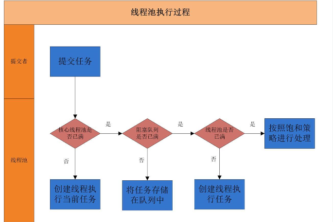
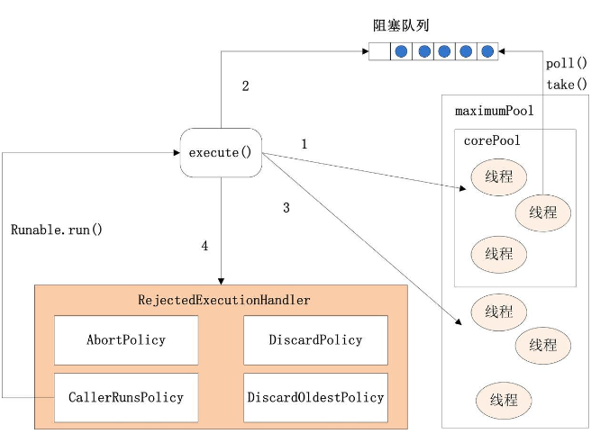

# **ThreadPoolExecutor** 线程池

##  **线程池**

开发中几乎所有的并发或者异步程序都可以使用线程池，它能带来三个好处：

1. **降低资源消耗。**通过复用已存在的线程和降低线程关闭的次数来尽可能降低系统性能损耗；
2. **提升系统响应速度。**通过复用线程，省去创建线程的过程，因此整体上提升了系统的响应速度；
3. **提高线程的可管理性。**线程是稀缺资源，如果无限制的创建，不仅会消耗系统资源，还会降低系统的稳定性，因此，需要使用线程池来管理线程。

## **线程池的工作原理**




线程池的工作流程是这样：

1. 先判断线程池中**核心线程池**所有的线程是否都在执行任务。如果不是，则新创建一个线程执行刚提交的任务，否则，核心线程池中所有的线程都在执行任务，则进入第2步；
2. 判断当前**阻塞队列**是否已满，如果未满，则将提交的任务放置在阻塞队列中；否则，则进入第3步；
3. 判断**线程池中所有的线程**是否都在执行任务，如果没有，则创建一个新的线程来执行任务，否则，则交给饱和策略进行处理


## 线程池的创建

创建线程池主要是**ThreadPoolExecutor**类来完成，ThreadPoolExecutor的有许多重载的构造方法，通过参数最多的构造方法来理解创建线程池有哪些需要配置的参数。ThreadPoolExecutor的构造方法为：

```java
ThreadPoolExecutor(int corePoolSize,
                   int maximumPoolSize,
                   long keepAliveTime,
                   TimeUnit unit,
                   BlockingQueue<Runnable> workQueue,
                   ThreadFactory threadFactory,
                   RejectedExecutionHandler handler)

```

下面对参数进行说明：

* **corePoolSize**：表示核心线程池的大小。当提交一个任务时，如果当前核心线程池的线程个数没有达corePoolSize，则会创建新的线程来执行所提交的任务，即使当前核心线程池有空闲的线程。如果当前核心线程池的线程个数已经达到了corePoolSize，则不再重新创建线程。如果调用了prestartCoreThread()或者 prestartAllCoreThreads()，线程池创建的时候所有的核心线程都会被创建并且启动。

* **maximumPoolSize**：表示线程池能创建线程的最大个数。如果当阻塞队列已满时，并且当前线程池线程个数没有超过maximumPoolSize的话，就会创建新的线程来执行任务。

* **keepAliveTime**：空闲线程存活时间。如果当前线程池的线程个数已经超过了corePoolSize，并且线程空闲时间超过了keepAliveTime的话，就会将这些空闲线程销毁，这样可以尽可能降低系统资源消耗。

* **unit**：时间单位。为keepAliveTime指定时间单位。

* **workQueue**：阻塞队列。用于保存任务的阻塞队列。可以使用ArrayBlockingQueue, LinkedBlockingQueue, SynchronousQueue, PriorityBlockingQueue。

* **threadFactory**：创建线程的工程类。可以通过指定线程工厂为每个创建出来的线程设置更有意义的名字，如果出现并发问题，也方便查找问题原因。

* **handler**：饱和策略。当线程池的阻塞队列已满和指定的线程都已经开启，说明当前线程池已经处于饱和状态了，那么就需要采用一种策略来处理这种情况。采用的策略有这几种：

  * AbortPolicy： 直接拒绝所提交的任务，并抛出RejectedExecutionException异常；

  * CallerRunsPolicy：只用调用者所在的线程来执行任务；
  * DiscardPolicy：不处理直接丢弃掉任务；
  * DiscardOldestPolicy：丢弃掉阻塞队列中存放时间最久的任务，执行当前任务


##  线程池执行逻辑

```java
public void execute(Runnable command) {
        if (command == null)
            throw new NullPointerException();
        /*
         * Proceed in 3 steps:
         *
         * 1. If fewer than corePoolSize threads are running, try to
         * start a new thread with the given command as its first
         * task.  The call to addWorker atomically checks runState and
         * workerCount, and so prevents false alarms that would add
         * threads when it shouldn't, by returning false.
         *
         * 2. If a task can be successfully queued, then we still need
         * to double-check whether we should have added a thread
         * (because existing ones died since last checking) or that
         * the pool shut down since entry into this method. So we
         * recheck state and if necessary roll back the enqueuing if
         * stopped, or start a new thread if there are none.
         *
         * 3. If we cannot queue task, then we try to add a new
         * thread.  If it fails, we know we are shut down or saturated
         * and so reject the task.
         */
        int c = ctl.get();
    //如果线程数小于核心线程池corePoolSize
        if (workerCountOf(c) < corePoolSize) {
            if (addWorker(command, true))	//创建新线程去执行任务
                return;
            c = ctl.get();
        }
    //如果线程个数大于corePoolSize或者创建线程失败，则将任务存放在阻塞队列workQueue中
        if (isRunning(c) && workQueue.offer(command)) {
            int recheck = ctl.get();
            if (! isRunning(recheck) && remove(command))
                reject(command);
            else if (workerCountOf(recheck) == 0)
                addWorker(null, false);
        }
        else if (!addWorker(command, false))
            reject(command);
    }
```

ThreadPoolExecutor的execute方法执行逻辑请见注释。下图为ThreadPoolExecutor的execute方法的执行示意图：



execute方法执行逻辑有这样几种情况：

1. 如果当前运行的线程数少于corePool,那么就创建新的线程去执行任务（需要获取全局锁）
2. 如果运行的线程个数等于或者大于corePoolSize，则会将提交的任务存放到阻塞队列workQueue中；
3. 对于有界队列，当阻塞队列满了之后，会创建新的线程来执行任务
4. 如果线程数超过 maximumPoolSize就会使用饱和策略来处理

在执行execute方法时，尽可能的为了避免获取全局锁，那样会严重影响性能，在预热完成之后，就是线程数大于核心线程数之后，几乎全部采取缓存然后拉取执行的策略，这样就不需要获取全局锁。


## 关闭线程池

关闭线程池，可以通过shutdown和shutdownNow这两个方法。它们的原理都是遍历线程池中所有的线程，然后依次中断线程。shutdown和shutdownNow还是有不一样的地方：

* shutdownNow首先将线程池的状态设置为STOP,然后尝试停止所有的正在执行和未执行任务的线程，并返回等待执行任务的列表；
* shutdown只是将线程池的状态设置为SHUTDOWN状态，然后中断所有没有正在执行任务的线程

可以看出shutdown方法会将正在执行的任务继续执行完，而shutdownNow会直接中断正在执行的任务。调用了这两个方法的任意一个，isShutdown方法都会返回true，当所有的线程都关闭成功，才表示线程池成功关闭，这时调用isTerminated方法才会返回true。

## **如何合理配置线程池参数**

要想合理的配置线程池，就必须首先分析任务特性，可以从以下几个角度来进行分析：

* 任务的性质：CPU密集型任务，IO密集型任务和混合型任务。

* 任务的优先级：高，中和低。

* 任务的执行时间：长，中和短。

* 任务的依赖性：是否依赖其他系统资源，如数据库连接。

CPU密集型任务应尽可能小的的线程，如cpu 数+1（可以通过`Runtime.getRuntime().availableProcessors()`方法获得当前设备的CPU个数。）

IO密集型的并不是一直在执行任务，所以线程可以尽可能的多，如2 * cpu数

如过可以拆分，将其拆分成CPU密集 和IO 密集的任务，如果两个任务执行时间差距较大就没有必要拆分了

优先级不同的任务可以使用优先级队列PriorityBlockingQueue来处理。它可以让优先级高的任务先得到执行，需要注意的是如果一直有优先级高的任务提交到队列里，那么优先级低的任务可能永远不能执行。（发生饥饿）

执行时间不同的任务可以交给不同规模的线程池来处理，或者也可以使用优先级队列，让执行时间短的任务先执行。

依赖数据库连接池的任务，因为线程提交SQL后需要等待数据库返回结果，如果等待的时间越长CPU空闲时间就越长，那么线程数应该设置越大，这样才能更好的利用CPU。

并且，阻塞队列最好是使用有界队列，如果采用无界队列的话，一旦任务积压在阻塞队列中的话就会占用过多的内存资源，甚至会使得系统崩溃。


