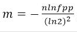

# 缓存设计方案

只有数据库的时候，所有的数据库操作都会落在数据库上，但是数据库所能承受的最大并发量有限，而且数据库操作比较耗费时间，所以在数据库之前引入一层缓存，第一次查询时去到数据库，然后把数据存储到缓存中。后续的查询就可以根据Kdy-Value对应的结构，去查询到结果，甚至可以根据参数，直接略过运算过程直接获得结果，大幅度提高速度。

缓存一般在内存中存储，而且存储的都是热点的访问数据能够代替数据库应对大部分的查询，对于数据库而言，压力就会小了很多，只用去应对少部分量不大的查询。

所以过程就是这样：

### 读取流程


### 更新流程


这里先讨论一下为什么要在数据库更新之后失效缓存，而不是更新缓存

* 如果同步更新，会有数据库更新了多次，而并没有查询请求过来的情况，这样就会出现多次更新缓存无效，浪费了，资源，失效了缓存在需要查询的时候在加载到缓存中实际上一种懒加载的思想。
* 失效缓存可以腾出内存空间

然后讨论一下为什么顺序是先更新数据库在，失效缓存

如果先删除缓存在更新数据库的话，会有这样一个并发场景，有一个更新和读操作，读在更新操作删除了缓存之后到达，造成数据不一致

先更新数据库的时候就策略就可以先更新数据库中数据，并发的读操作就是去缓存中拿到当前还不过期的数据，然后失效缓存，后面的查询数据就是一致的。

当然这里也会有一些问题：

- 缓存如果挂掉，会全部进入到数据库，导致数据库不可用，然后整个服务挂了（缓存雪崩）
- 请求在缓存区间之外，每次都不命中缓存，全部击穿到数据库，然后数据库也不存在，也不写如缓存，导致负载过高，数据库不可用（缓存穿透）
- 缓存的过期时间相同，导致缓存同时更新，使数据库压力过高

### 第一个问题，针对缓存挂了的情况

1. 事件发生之前： 保证数据库的高可用性 ，使用主从节点的方式
2. 事件发生时：在缓存控制层实现实现一个**本地缓存+限流** ，对外部报警，保证服务可用性，别全部请求到数据库层面，支撑到缓存服务回复
3. 事件发生后：设置Redis 使用RDB+AOF的持久化，快速回复缓存

### 第二个问题，针对击穿，缓存 ，数据库都不存在

通过布隆过滤器过滤掉不在数据库和缓存中的请求，插入数据库的时候也插入布隆过滤器中，不用考虑更新的情况，布隆只用来判断存在不存在。

引发的问题： 数据库的更新和布隆的更新不原子，出现数据库成功，布隆插入失败的情况

解决方案： 通过一个队列进行发送消息，自己消费信息，然后异步循环插入直到成功，如果缓存也挂了，那就报错出去

### 第三个问题，同步过期

通过Redis 自定义的策略在访问缓存的时候，发现过期才去数据库拉去新的值

具体策略 ： 过期后再次访问不存在，在去获取新的，内存达到上限周期性扫描删除过期的值


---

针对这几个问题实现了第二版的方案，缓存挂了的情况，采取报警并抛出异常给上层的方式处理；缓存击穿，采取布隆过滤器的方式解决；同步过期的问题，设置过期时间，用Redis过期查询删除并且到内存达到上限时扫描删除的方式。

### 读取流程


### 更新流程


### 新增流程


### 对外接口

* 增加数据 ： 把对象存储的对象和值转化成字符串，存储缓存起来
* 读取数据 ：把根据字符串来读取是否存在
* 更新数据 ：根据存储的字符串和要更新的值去更新字符串

```java
public String getValue(String query);

public int putValue(String name, String value) throws Exception;

public int updateValue(String name,String value)throws Exception;
```

### 测试结果


平均查询时间在30~40ms之间

---

## 布隆过滤器

### 原理

布隆过滤器可以用于检索一个元素是是否存在于集合中，它本质上是一系列随机映射函数和一个很长的二进制向量，时间复杂度和空间复杂度都远超常规算法，但是存在的缺陷是有一定的误差率和删除困难。

一般想法是：

* 建立一个很长的二进制数组
* 通过随机函数把数据映射到不同的位置上
* 把对应位置的值从0设置成1

通过三个hash函数的映射来建立布隆过滤器，分别映射到不同的位置


其中最重要的部分就是hash函数的使用，我们希望能把数据平均的分配在这个数组上，并且快速。有一个murmurhash函数，在guava,redis 中都有使用，核心思想就是不断累乘。不过如果根据实际场景，我们可以轻易的发现，误差率和二进制向量的长度，和hash函数的个数有关系，那么对于我们希望的误差率，到底需要多少个hash函数（K）以及多大的数组长度呢（K）？在《数学之美》中吴军博士对此有详细的推导过程，具体结果如下：




- k : hash函数个数
- fpp: 误报率
- m: 二进制数组大小
- n: 预估的数据量大小

### 实现

使用Redis的bitmap来作为底层的二进制数组存储，误差率和初始存储量通过配置文件写入，使用murmurhash函数通过截取高位和地位通过组合运算，实现多个hash函数。另外随着插入元素越来越多，超过初设的范围，误差率会越来越高，因此增加了自动扩容的特性。

BoomFilterUtil

```java
/**
     * @Description: 把字符串放入缓存
     * @Param: [query]
     * @return: void
     * @Author: Huabuxiu
     * @Date: 2019-08-13
     */ 

public void putQueryInCache(String query){

          int[] ipoffset = hash(query);		//获取到字符串对应的偏移位置数组
          for (int i = 0 ; i < ipoffset.length ; i++){
              putBitInCache(bitMaplist.get(MultipleLocate),ipoffset[i],true);	//放置一位到bitmap中去
          }
       
        }

/**
    * @Description: 查询字符串是否在缓存中
     * 判断每个都在
    * @Param:query
    * @return:
    * @Author: Huabuxiu
    * @Date: 2019-08-13
    */
public boolean IsinCache(String query){
      int[] ipoffset = hash(query);
            for (int offset : ipoffset) {
                if (!valOps.getBit(bitMaplist.get(i), offset)) {
                   return false;
                }
            }
  			return true;  
}

```

BloomFilterHelper

```java
  /** 
    * @Description: 根据hash值获取偏移位置数组
    * @Param:  要存储的字符串
    * @return:  对应的偏移位置
    * @Author: Huabuxiu 
    * @Date: 2019-08-26 
    */ 
public int[] murmurHashOffset(String value) {
        int[] offset = new int[numHashFunctions];	//偏移数组
        long hash64 = hashSting(value);
  //构造多个hash位置
        int hash1 = (int) hash64;
        int hash2 = (int) (hash64 >>> 32);
        for (int i = 1; i <= numHashFunctions; i++) {
            int nextHash = hash1 + i * hash2;
            if (nextHash < 0) {
                nextHash = ~nextHash;
            }
            offset[i - 1] = nextHash % bitSize;		//计算对应下标
        }
        return offset;
    }
```


扩容方案

在Redis中存储一个倍数Multiple，当前key对应的bitmap已经达到饱和的状态，倍数自增Multiple++，

再用根据倍数生成一个新的key,创建规模相同的bitmap，在查询的时候，需要判断该元素是否存在于任意一个bitmap中，插入时在当前的bitmap中插入


BoomFilterUtil

```java
 /**
     * @Description: 把字符串放入缓存
     * @Param: [query]
     * @return: void
     * @Author: Huabuxiu
     * @Date: 2019-08-13
     */
    public void putQueryInCache(String query){

        int[] ipoffset = hash(query);
        for (int i = 0 ; i < ipoffset.length ; i++){
            putBitInCache(bitMaplist.get(MultipleLocate),ipoffset[i],true);
        }
        valOps.increment(count);


        if ((range * 0.95) <= (int)valOps.get(count)){
        //扩容需要加并发锁
            synchronized(Lock) {
                if ((range * 0.95) <= (int) valOps.get(count)) {  //双重检验锁
                    //倍数自加
                    MultipleLocate++;
                    valOps.increment(Multiple);
                    //本地list增加扩容的一个bitmap
                    bitMaplist.add(bitmap + "-" + MultipleLocate);
                    //Redis增加一个
                    valOps.set(bitmap, valOps.get(bitmap) + bitmap + "-" + MultipleLocate + Separate);
                    valOps.set(count, 0);
                }
            }
        }
    }


 /**
    * @Description: 查询字符串是否在缓存中
     * 判断每个都在
    * @Param:query
    * @return:
    * @Author: Huabuxiu
    * @Date: 2019-08-13
    */
    public boolean IsinCache(String query){
        //初始化成全true
        boolean[] flags = new boolean[bitMaplist.size()];
        for (int i = 0; i< flags.length ; i++){
            flags[i] = true;
        }

        int[] ipoffset = hash(query);
        for (int i =0 ; i< bitMaplist.size(); i++) {   //遍历每一个都不存在就不存在
            for (int offset : ipoffset) {
                if (!valOps.getBit(bitMaplist.get(i), offset)) {
                    flags[i] = false;
                    break;
                }
            }
        }

        for (boolean flag : flags){
            if (flag)
                return true;
        }
        return false;
    }

```

### 测试结果

30万数据测试，误差率在万分之一左右，单次查询在5ms左右


## 总结

立足于Redis，对常见的缓存问题根据具体问题提出了相应的办法，并结合Redis 实现了一个支持自定义误差率和动态扩容的布隆过滤器，可以部署在分布式或者其他系统中。

