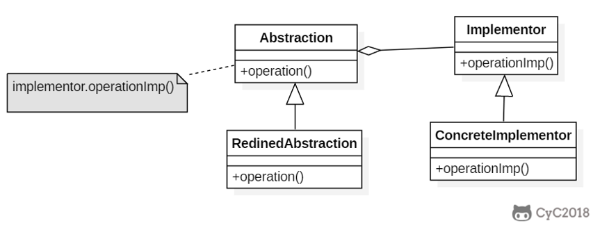
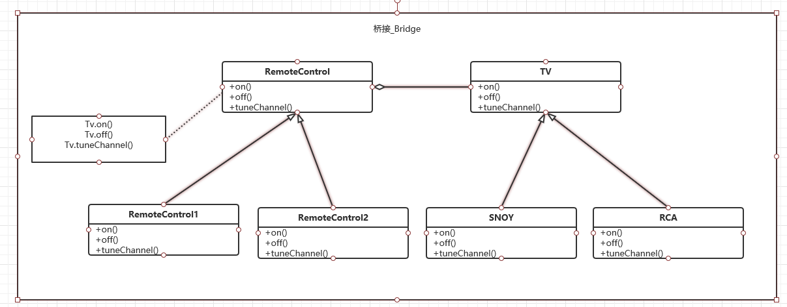

# 桥接（Bridge）

桥接（Bridge）是用于把抽象化与实现化解耦，使得二者可以独立变化。这种类型的设计模式属于结构型模式，它通过提供抽象化和实现化之间的桥接结构，来实现二者的解耦。

将抽象与实现分离开来，使它们可以独立变化。


## 介绍
**意图：**将抽象部分与实现部分分离，使它们都可以独立的变化。

**主要解决：**在有多种可能会变化的情况下，用继承会造成类爆炸问题，扩展起来不灵活。

**何时使用：**实现系统可能有多个角度分类，每一种角度都可能变化。

**如何解决：**把这种多角度分类分离出来，让它们独立变化，减少它们之间耦合。

**关键代码：**抽象类依赖实现类。

## 结构

### 抽象结构



### 实例结构




## 代码演示

### RemoteControl <-> Abstraction。

```java
public abstract class RemoteControl  {
    protected  TV tv;

    public RemoteControl(TV tv) {
        this.tv = tv;
    }

    public abstract  void on();
    public abstract  void off();
    public abstract  void tuneChannel();

}

```

### TV<->  Implementor

```JAVA
public abstract class TV {
    public abstract void on();

    public abstract void off();

    public abstract void tuneChannel();
}

```

### RedinedAbstraction <-> ConcreteRemoteControl1 ConcreteRemoteControl2

```java
public class ConcreteRemoteControl1 extends RemoteControl {

    public ConcreteRemoteControl1(TV tv) {
        super(tv);
    }

    @Override
    public void on() {
        System.out.println("ConcreteRemoteControl1.on");
        tv.on();
    }

    @Override
    public void off() {
        System.out.println("ConcreteRemoteControl1.off");
        tv.off();
    }

    @Override
    public void tuneChannel() {
        System.out.println("ConcreteRemoteControl1.tuneChannel");
        tv.tuneChannel();
    }
}

```

```java
public class ConcreteRemoteControl2 extends RemoteControl {

    public ConcreteRemoteControl2(TV tv) {
        super(tv);
    }

    @Override
    public void on() {
        System.out.println("ConcreteRemoteControl2.on");
        tv.on();
    }

    @Override
    public void off() {
        System.out.println("ConcreteRemoteControl2.off");
        tv.off();
    }

    @Override
    public void tuneChannel() {
        System.out.println("ConcreteRemoteControl2.tuneChannel");
        tv.tuneChannel();
    }
}

```

### ConcreteLmplementor <-> SNOY RCA

```java
public class Sony extends TV {
    @Override
    public void on() {
        System.out.println("Sony.on");
    }

    @Override
    public void off() {
        System.out.println("Sony.off");

    }

    @Override
    public void tuneChannel() {
        System.out.println("Sony.tuneChannel");

    }
}

```

```java
public class RCA extends TV {
    @Override
    public void on() {
        System.out.println("RCA.on");
    }

    @Override
    public void off() {
        System.out.println("RCA.off");

    }

    @Override
    public void tuneChannel() {
        System.out.println("RCA.tuneChannel");

    }
}

```

### 测试代码

```java
 @Test
    public void on() {
        TV snoy = new Sony();
        TV rca = new RCA();

       RemoteControl remoteControl1 = new ConcreteRemoteControl1(snoy);
       RemoteControl remoteControl2 = new ConcreteRemoteControl2(rca);

       remoteControl1.on();
       remoteControl1.off();
       remoteControl1.tuneChannel();
        remoteControl2.on();
        remoteControl2.off();
        remoteControl2.tuneChannel();
    }
```


## JDK中使用

- AWT (It provides an abstraction layer which maps onto the native OS the windowing support.)
- JDBC

