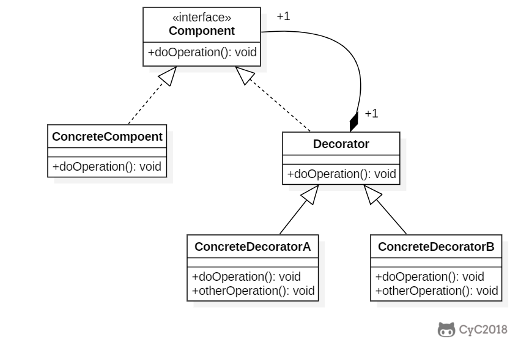
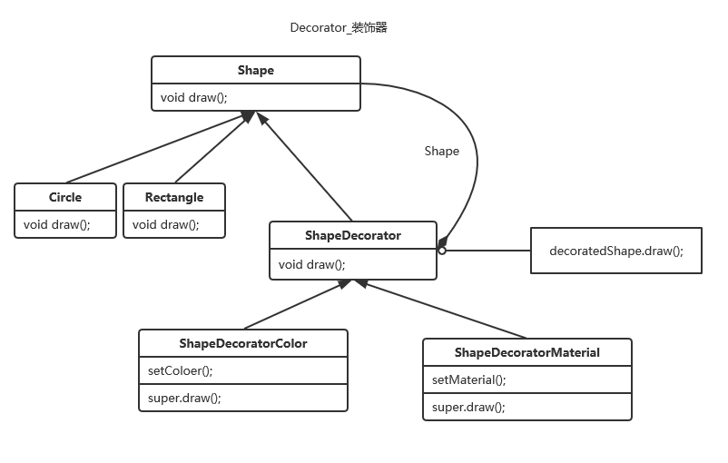

# 装饰器模式

装饰器模式（Decorator Pattern）允许向一个现有的对象添加新的功能，同时又不改变其结构。这种类型的设计模式属于结构型模式，它是作为现有的类的一个包装。

动态的往一个类里增加功能

## 介绍

**意图：**动态地给一个对象添加一些额外的职责。就增加功能来说，装饰器模式相比生成子类更为灵活。

**主要解决：**一般的，我们为了扩展一个类经常使用继承方式实现，由于继承为类引入静态特征，并且随着扩展功能的增多，子类会很膨胀。

**何时使用：**在不想增加很多子类的情况下扩展类。

**如何解决：**将具体功能职责划分，同时继承装饰者模式。

**关键代码：** 1、Component 类充当抽象角色，不应该具体实现。 2、修饰类引用和继承 Component 类，具体扩展类重写父类方法。 

**优点：**装饰类和被装饰类可以独立发展，不会相互耦合，装饰模式是继承的一个替代模式，装饰模式可以动态扩展一个实现类的功能。

**缺点：**多层装饰比较复杂。

**使用场景：** 1、扩展一个类的功能。 2、动态增加功能，动态撤销。 

**注意事项：**可代替继承。

## 结构

### 抽象结构



### 实例结构



## 代码演示

实例中 一个图形可能会有颜色，材质等等多种属性，不同需求的不同继承会产生多种情况，通过组合就可以在运行时发挥多态属性，非常妙。

### Commponet     <-> 	Shape

``` java
package Decorator;

public interface Shape {
    void draw();
}

```

### ConcreteCommponet   <->  C ircle  Rectagle 

```java
public class Rectangle implements Shape {
    @Override
    public void draw() {
        System.out.println("Shape : Rectangle");
    }
}
```

```java
public class Circle implements Shape {
    @Override
    public void draw() {
        System.out.println("Shape : Circle");
    }
}

```

### Decorator     <->    ShareDecorator

```java
public abstract class ShapeDecorator implements Shape {

    Shape decoratedShape;   //装饰，使用基类来多态

    public ShapeDecorator(Shape shape) {
        this.decoratedShape = shape;
    }

    @Override
    public void draw() {
        decoratedShape.draw();  //运行时多态
    }
}

```

### ConcreteDecoratorA <-> ShapeDecoratorColor

```java
public class ShapeDecoratorColor extends ShapeDecorator {

    public ShapeDecoratorColor(Shape shape) {
        super(shape);
    }
    void setColoer(){
        System.out.println("Color : Red");
    }

    @Override
    public void draw() {
        setColoer();
        super.draw();
    }

}

```

### ConcreteDecoratorB <-> ShapeDecoratorMaterial

```java
public class ShapeDecoratorMaterial extends ShapeDecorator {
    public ShapeDecoratorMaterial(Shape shape) {
        super(shape);
    }

    void setMaterial(){
        System.out.println("Material : Smooth");
    }

    @Override
    public void draw() {
        setMaterial();
        super.draw();
    }
}

```

### 测试代码

```java
   @Test
    public void draw() {
        Shape Circle = new Circle();
        Shape Rectangle = new Rectangle();

        //装饰器来组合的用
        ShapeDecoratorColor RedCircle = new ShapeDecoratorColor(Circle);
        ShapeDecoratorColor RedRectangle = new ShapeDecoratorColor(Rectangle);

        ShapeDecoratorMaterial SmoothCircle = new ShapeDecoratorMaterial(Circle);

        RedCircle.draw();
        RedRectangle.draw();
        SmoothCircle.draw();
    }
```


## 设计原则
类应该对扩展开放，对修改关闭：也就是添加新功能时不需要修改代码。饮料可以动态添加新的配料，而不需要去修改饮料的代码。

不可能把所有的类设计成都满足这一原则，应当把该原则应用于最有可能发生改变的地方。


## JDK

- java.io.BufferedInputStream(InputStream)
- java.io.DataInputStream(InputStream)
- java.io.BufferedOutputStream(OutputStream)
- java.util.zip.ZipOutputStream(OutputStream)
- java.util.Collections   List|Map|Set|SortedSet|SortedMap