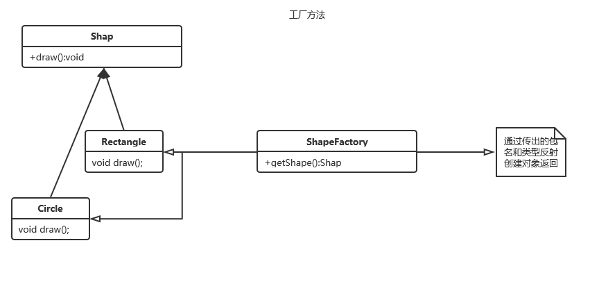

# Factory Method 工厂方法

工厂模式（Factory Pattern）是 Java 中最常用的设计模式之一。这种类型的设计模式属于创建型模式，它提供了一种创建对象的最佳方式。
在工厂模式中，我们在创建对象时不会对客户端暴露创建逻辑，并且是通过使用一个共同的接口来指向新创建的对象。

## 介绍

**意图：**定义一个创建对象的接口，让其子类自己决定实例化哪一个工厂类，工厂模式使其创建过程延迟到子类进行。
**主要解决：**主要解决接口选择的问题。
**何时使用：**我们明确地计划不同条件下创建不同实例时。
**如何解决：**让其子类实现工厂接口，返回的也是一个抽象的产品。
**关键代码：**创建过程在其子类执行。

**使用场景：**
1、日志记录器：记录可能记录到本地硬盘、系统事件、远程服务器等，用户可以选择记录日志到什么地方。
2、数据库访问，当用户不知道最后系统采用哪一类数据库，以及数据库可能有变化时。
3、设计一个连接服务器的框架，需要三个协议，"POP3"、"IMAP"、"HTTP"，可以把这三个作为产品类，共同实现一个接口。

**注意事项：**作为一种创建类模式，在任何需要生成复杂对象的地方，都可以使用工厂方法模式。有一点需要注意的地方就是复杂对象适合使用工厂模式，而简单对象，特别是只需要通过 new 就可以完成创建的对象，无需使用工厂模式。如果使用工厂模式，就需要引入一个工厂类，会增加系统的复杂度。

## 结构

### 抽象结构


### 实例结构



## 代码演示

### Shap <-> Product

```java

public abstract class Shape {
    public abstract void draw();
}

```

### ConreteProduct <-> Circle Rectangle

```java
public class Circle extends Shape {
    @Override
    public void draw() {
        System.out.println("Shape : Circle");
    }
}
```

```java
public class Rectangle extends Shape {
    @Override
    public void draw() {
        System.out.println("Shape : Rectangle");
    }
}

```

### ConcreteFactory <->  ShapeFactory

采用了反射的方式，从输入的包名里查找，返回配置文件中所需要的类

```java
public  class ShapeFactory {


    Set<String> ShapeNameSet = null;

    public Shape getShape(String shapeTyppe, String packageName){
        if (shapeTyppe == null){
            return  null;
        }
        ShapeNameSet = getShapeNameSet(packageName);  
        if (!ShapeNameSet.contains(shapeTyppe)){
            System.out.println("wrong Type");
        }else {
            try {
                Class shapeclass = Class.forName(packageName+"."+shapeTyppe);
                Shape shape = (Shape) shapeclass.newInstance();
                return shape;
            } catch (ClassNotFoundException e) {
                e.printStackTrace();
            } catch (InstantiationException e) {
                e.printStackTrace();
            } catch (IllegalAccessException e) {
                e.printStackTrace();
            }
        }

        return null;
    }


    Set<String> getShapeNameSet(String packageName){
        Set<String> ShapeNameSet = null;
        //获取类加载器
        ClassLoader classLoader = Thread.currentThread().getContextClassLoader();

        String packagePath = packageName.replace(".", "/");

        URL url = classLoader.getResource(packagePath);
        if (url != null){
            String protocol = url.getProtocol();
            if (protocol.equals("file")){
                ShapeNameSet = getClassNameFromDir(url.getPath(),packageName,false);
            }
        }
        return ShapeNameSet;
    }

    Set<String> getClassNameFromDir(String filePath,String packageName,boolean isRecursion) {
        Set<String> classNameSet = new HashSet<>();
        File file = new File(filePath);
        File[] files = file.listFiles();

        for (File childFile : files) {
            if (childFile.isDirectory() && isRecursion){
                classNameSet.addAll(getClassNameFromDir(childFile.getPath(),
                        packageName+"."+childFile.getName(),
                        isRecursion));
            }else{
                String fileName = childFile.getName();
                if (fileName.endsWith(".class") && !fileName.contains("$")){
                    classNameSet.add(fileName.replace(".class",""));
                }
            }
        }
        return classNameSet;
    }

}

```

### 测试代码

```java
public class FactoryMethodTest {
    ShapeFactory shapeFactory =  new ShapeFactory();

    @Test
    public void factoryMethod() {

       Shape Circle = shapeFactory.getShape("Circle","FactoryMethod.Shapes");
       Circle.draw();
    }

    @Test
    public void Rectangle() {

        Shape Rectangle = shapeFactory.getShape("Rectangle","FactoryMethod.Shapes");
        Rectangle.draw();
    }
}
```

### JDK

- java.util.Calendar
- java.util.ResourceBundle
- java.text.NumberFormat
- java.nio.charset.Charset
- java.net.URLStreamHandlerFactory
- java.util.EnumSet
- javax.xml.bind.JAXBContext

